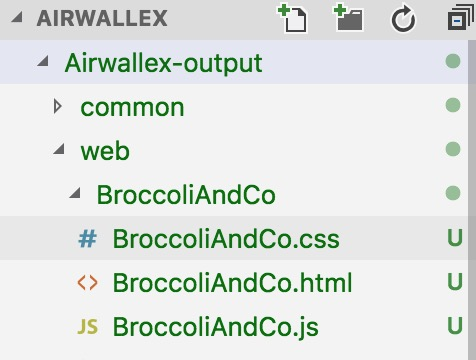

### npm istall
### type "npm start" to start dev mode and visit http://localhost:6060/web/SimplifySwitchUITheme/SimplifySwitchUITheme.html#/ to check the function.
### type "npm run project-build" to release this project and the output result like the following image:

